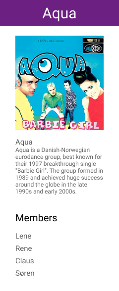
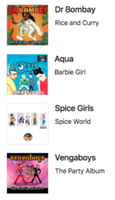

# Övningar - Bootstrap

## Övning 1
Använd bootstraps `col` och `row`-klasser för att bygga följande strukturer:

a)


b)


c)


d)


e)


## Övning 2

a) Vad kommer att hända med den andra kolumnen i följande kod? Varför?
```html
<div class="container">
  <div class="row">
    <div class="col-6">
      <!-- column content -->
    </div>
    <div class="col-7">
      <!-- column content -->
    </div>
  </div>
</div>
```
b) Vad kommer att hända med de två sista kolumnerna i följande kod? Varför?
```html
<div class="container">
  <div class="row">
    <div class="col-6">
      <!-- column content -->
    </div>
    <div class="col-7">
      <!-- column content -->
    </div>
    <div class="col-5">
      <!-- column content -->
    </div>
  </div>
</div>
```

c) Vad händer med de två sista kolumnerna i följande kod? Varför?
```html
<div class="container">
  <div class="row">
    <div class="col-4">
      <!-- column content -->
    </div>
    <div class="col">
      <!-- column content -->
    </div>
    <div class="col">
      <!-- column content -->
    </div>
  </div>
</div>
```

## Övning 3
Skapa följande med hjälp av bootstrap:

a) En rad med två kolumner där kolumnerna endast visas på samma rad om bredden är större än 540 pixlar.

b) En rad med två kolumner där kolumnerna endast visas på samma rad om bredden är större än 1140 pixlar.

c) En rad med fyra lika stora kolumner där alla kolumnerna visas på egna rader på små skärmar om bredden är mindre än 540 pixlar.

d) En rad med fyra lika stora kolumner där de två sista kolumnerna visas på egna rader om bredden är mindre än 540 pixlar.

e) En rad med tre lika stora kolumner där den sista kolumnen ska fylla ut en ny egen rad om bredden är mindre än 540 pixlar. Jämför bilderna nedan:


f) En rad med tre kolumner där den mittersta kolumnen ändrar sig beroende på längden på innehållet.

*Tips: Använd bootstrap breakpoints*

## Övning 4
a) Implementera en layout med 4 kolumner **inom samma `.row`-element** där de två sista kolumnerna visas på en egen rad. Använd dig av bootstraps grid-klasser.

b) Implementera samma som i uppgiften ovan med hjälp av `.w-100`

## Övning 5
Använd dig av breakpoints för att implementera en layout som följer följande mönster
beroende på containerns storlek:

Stor:


Mellan:


Liten:


## Övning 6
a) Visa filen `blomma.png` och `uggla.png` enligt layouten nedan. Använd bootstrap för att göra bilderna responsiva så att de ändrar storlek beroende på fönstret.


b) Implementera följande layout på liknande sätt med hjälp av bootstraps klasser.


c) Implementera a) så att `uggla.png` hamnar på en egen rad om fönstret är litet.

d) Implementera följande layout på liknande sätt med hjälp av bootstraps klasser.


Bilderna finns i mappen _resources_.

## Övning 7
Implementera följande layouter med hjälp av bootstrap:

a)


b)


c)


## Övning 8
Skapa en ny HTML-sida och använd dig av bootstrap för implementera en responsiv layout enligt följande mocks:

Stort fönster:


Litet fönster:



Bilden finns i mappen _resources_.

## Övning 9
Använd `.media`-klassen i bootstrap för att skapa en lista med album som i följande mocks:



Bilden finns i mappen _resources_.

## Övning 10
Lista följande data i en bootstrap-tabell

| Namn          | Ålder           | Stad | Tröjstorlek |
| ------------- |------------- | ---- | ----------- |
| Lisa Svensson    | 45 | Ängelholm | M |
| Gunnar Gunnarsson    | 19 | Borlänge | M |
| Mia Larsson | 33 | Boden | XL |
| Kim Ek | 87 | Åmål | S |

## Övning Display/visibility

## Övning Utilities 1

## Övning Utilities 2

## Övning Utlities 3

## Övning Components 1
Skapa en HTML-sida för att registrera användaruppgifter. Du får själv utforma hur sidan ska se ut men den ska uppfylla följande krav:

* Användaren ska kunna skriva i sitt för- och efternamn i ett input-fält.
* Användaren ska kunna fylla i sin ålder.
* Användaren ska kunna fylla i sitt telefonnummer och email.
* Användaren ska kunna välja en sysselsättning ur en lista mellan följande alternativ:
  * Anställd
  * Egen företagare
  * Arbetssökande
  * Sjukskriven
  * Annat
* Användaren ska kunna välja att acceptera sidans villkor genom att klicka i en checkbox.
* Det ska finnas en knapp med titeln "Registrera".

## Övning Components 2

## Övning Sass?
* Teman
* mixins
*

## content
* Gå igenom hur man sätter man upp ett boootstrap-projekt
* ~~col (col-2, col-8 etc)~~
* ~~Auto column (e.g. vad händer om man bara sätter en col-x och resten till col? Auto är vad som händer.)~~
* ~~column wrapping (e.g. vad händer om col-count > 12)~~
* ~~breakpoints (-sm, -m), col-sm-8 vs col-8~~
* ~~col-md-auto~~
* ~~w-100~~

* align-items-center, align-self-center (återkoppla till flexbox)
* ~~justify-content-center, etc~~
* no-gutters
* order?
* ~~offset och margin~~

* ~~media objects~~
* visibility
* display

* ~~Responsive images~~
* ~~Tables~~

* Två friare övningar i Komponenter
* Utilities

### Kanske överkurs?
* Reboot
* SASS??
* mixins
* Skriva över SASS-variabler
* Teman?
